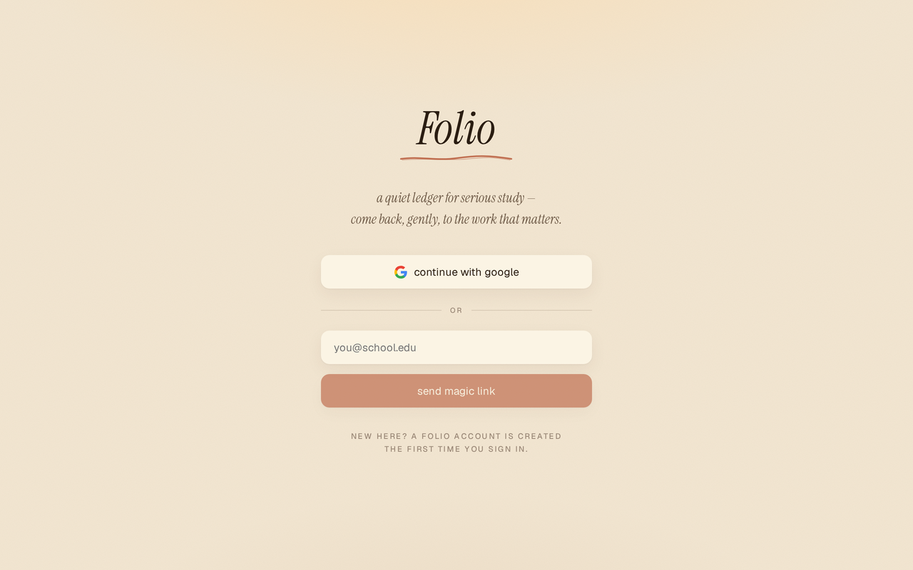

<div align="center">

# Folio

**A quiet ledger for serious study.**

A calm, single-page study companion that turns focused hours into something you can see and stay accountable to. Focus timer, study heatmap, habit streaks, a private journal, and a social "Society" where you and your friends can see who is actually putting in the hours. Built on React and Supabase, it syncs across devices with no server to run.


[**Live demo**](https://folio-kohl-one.vercel.app)



</div>

---

## Features

- **Focus timer.** Start a session with a tap or the spacebar, assign it to a subject, switch subjects with the arrow keys. Every session is logged.
- **Study heatmap.** A calendar where each day fills in by hours studied. Click a cell to see what you worked on.
- **Habits.** Track small daily things and watch the dots build into a streak.
- **The Society.** Create or join a group, backed by Supabase realtime presence (who is online and studying right now) and an hours leaderboard.
- **Journal.** Write what mattered today and Folio autosaves. Every Sunday it generates a personal weekly note.
- **Make it yours.** Add subjects, set daily goals, swap themes and font pairings, toggle privacy. Settings persist across devices.
- **Guided onboarding.** An interactive tour on mock data walks new users through every surface before they start fresh.

## Tech stack

| Layer | Technology |
|---|---|
| Frontend | React 18 + Vite |
| Backend (BaaS) | Supabase: Postgres, Auth (PKCE), Realtime presence, Edge Functions |
| Data | SQL migrations (`supabase/migrations/`) for the schema and the Society |
| Styling | Hand-rolled CSS, paper-grain theme, swappable font pairings |

## Project structure

```
src/
  App.jsx            App shell: providers, theme/font injection, router
  state.jsx          Folio data store + date/format helpers
  auth.jsx           Auth screens
  auth-context.jsx   Supabase auth context
  timer.jsx          Focus timer
  calendar.jsx       Study heatmap
  habits.jsx         Habit tracking
  society.jsx        Groups + realtime presence + leaderboard
  journal.jsx        Journal + weekly notes
  settings.jsx       Subjects, goals, themes, privacy
  shared.jsx         Shared UI primitives + font pairs
  onboarding/        Interactive product tour (mock data)
  lib/supabase.js    Supabase client
supabase/
  migrations/        0001_init.sql, 0002_society.sql
  functions/         delete-account edge function
```

## Running locally

```bash
# 1. Install dependencies
npm install

# 2. Configure Supabase
cp .env.example .env.local
#   VITE_SUPABASE_URL=...
#   VITE_SUPABASE_ANON_KEY=...

# 3. Apply the schema to your Supabase project
#    (run the SQL in supabase/migrations/ via the SQL editor or CLI)

# 4. Start the dev server
npm run dev
```

## License

MIT, see [LICENSE](LICENSE).
